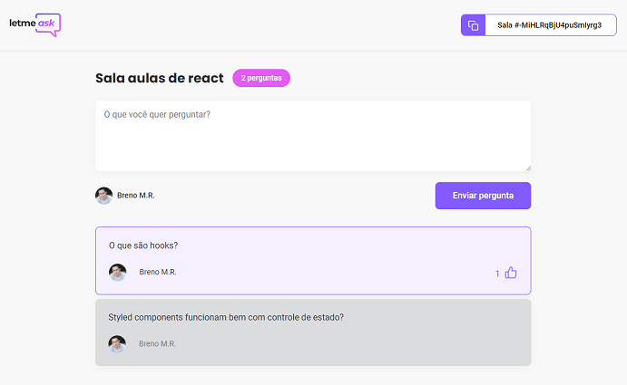

<h1 align="center">
  
</h1>

  <a href="#-tecnologias">Tecnologias</a>&nbsp;&nbsp;&nbsp;|&nbsp;&nbsp;&nbsp;
  <a href="#-projeto">Projeto</a>&nbsp;&nbsp;&nbsp;|&nbsp;&nbsp;&nbsp;
  <a href="#-layout">Layout</a>&nbsp;&nbsp;&nbsp;|&nbsp;&nbsp;&nbsp;
  <a href="#-como-executar">Como executar</a>&nbsp;&nbsp;&nbsp;|&nbsp;&nbsp;&nbsp;
  <a href="#-licença">Licença</a>

  
  
  

  

## :technologist: Tecnologias

Este projeto faz uso das seguintes tecnologias:
- [React](https://reactjs.org)
- [TypeScript](https://www.typescriptlang.org/)
- [Firebase](https://firebase.google.com/)
- [Create React App](https://github.com/facebook/create-react-app).

## 💻 Projeto

O Letmeask é uma aplicação web que permite o usuário criar salas de perguntas.
Desenvolvido durante o Next Level Week Together da Rocketseat.

## 🔖 Layout

O layout será disponivilizado futuramente.

## 🚀 Como executar

- Clone o repositório
- Instale as dependências com `yarn install`
- Inicie o servidor com `yarn start`

O servidor deverá iniciar no endereço: [http://localhost:3000](http://localhost:3000)

## 📄 Licença

Acesse [LICENSE](LICENSE.md) para mais informações sobre a licença.

## ♥ Agradecimento

A toda a equipe da Rocketseat por mostrar os caminhos para o próximo nível!